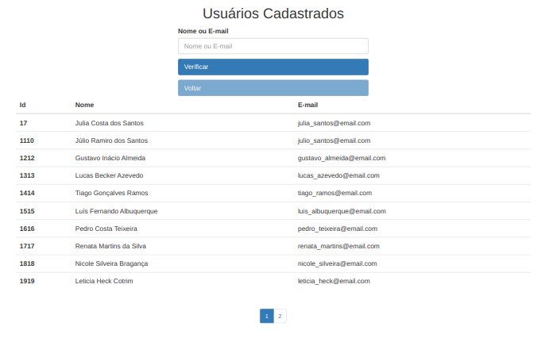

# Boas vindas ao repositório do projeto Teste MeuGuru


---

## Descrição do Projeto
Nesse projeto, eu construi um back-end usando `ORM` com o pacote `prisma` do `npm`, e fui capaz de:
 - Criar a tabela de usuários
 - Realizar a busca de usuários com a funcionalidade de paginação
 - Realizar a alteração de dados e excluir usuários

Já no front-end eu criei uma aplicação React com TypeScript e fui capaz de:
 - Montar uma tabela de usuários com os dados vindos do back-end
 - Buscar pelo nome no back-end e mostar os dados dos usuários encontrados
 - Realizar paginação a cada 10 usuários

---

## Imagem da Aplicação



## Instalação do projeto localmente

1. Abra o terminal e realize o clone do projeto:
```javascript
  git clone git@github.com:Humberto-Bonadiman/Teste-Meu-Guru.git
```

2. Acesse o diretório do projeto e depois utilize o comando **npm run install-all** para instalar todas as dependências necessárias:
```javascript
  cd Teste-Meu-Guru
  npm run install-all
```

3. Por último, abra duas abas do terminal e em uma rode o comando **npm run start-back** e na outra rode o comando **npm run start-front** acesse o projeto via browser, no caminho `http://localhost:3000/`.
```javascript
  npm run start-back
```
```javascript
  npm run start-front
```

---

## Teste

### Para testar a aplicação frontend utilize os comandos abaixo no terminal a partir da raiz do projeto

OBS.: Para rodar estes testes é necessário que tanto o frontend quanto o backend do projeto estejam rodando.

```javascript
  cd frontend
  npm run cypress:run
```

### Para testar a aplicação frontend utilize os comandos abaixo no terminal a partir da raiz do projeto

OBS.: Para rodar estes testes é necessário que o backend do projeto **NÃO** esteja rodando.

```javascript
  cd backend
  npm run test
```

---
